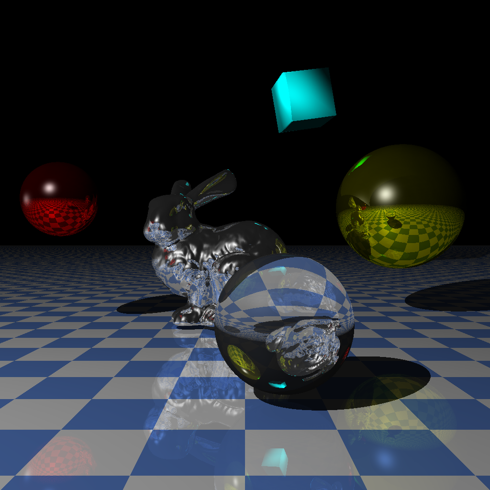

CS-636: Advanced Rendering Techniques - Ray Tracing
===================================================

README
------

General Information
-------------------
    Language:	C++11
    OS:	        Ubuntu 15.04 64-bit  
    Compiler:	g++ version 4.9.2 (Ubuntu 4.9.2-10ubuntu13)  
    IDE:        NetBeans IDE 8.0.2 (Build 201411181905)  
    Platform:   Intel® Core™ i5-4200U CPU with 7.5 GiB memory  
    Libraries:  tiff-4.0.3
                jpeg-9a

Author
------

    by Zach Liu  
    on May 30th, 2012

    updated (Ubuntu 22.04 64-bit with g++ 11.4.0)
    on Sep 3rd, 2024

Manifest
--------

    .
    ├── models
    │   ├── bound-bunny_1k.smf
    │   ├── bound-bunny_200.smf
    │   ├── bound-bunny_5k.smf
    │   ├── bound-lo-sphere.smf
    │   ├── bunny_69k.smf
    │   ├── cube.smf
    │   └── penguin.smf
    ├── raytracer
    │   ├── BRDFs
    │   │   ├── BRDF.cpp
    │   │   ├── BRDF.h
    │   │   ├── GlossySpecular.cpp
    │   │   ├── GlossySpecular.h
    │   │   ├── Lambertian.cpp
    │   │   ├── Lambertian.h
    │   │   ├── PerfectSpecular.cpp
    │   │   ├── PerfectSpecular.h
    │   │   ├── SV_GlossySpecular.cpp
    │   │   ├── SV_GlossySpecular.h
    │   │   ├── SV_Lambertian.cpp
    │   │   ├── SV_Lambertian.h
    │   │   ├── SV_PerfectSpecular.cpp
    │   │   └── SV_PerfectSpecular.h
    │   ├── BTDFs
    │   │   ├── BTDF.cpp
    │   │   ├── BTDF.h
    │   │   ├── PerfectTransmitter.cpp
    │   │   └── PerfectTransmitter.h
    │   ├── Cameras
    │   │   ├── Camera.cpp
    │   │   ├── Camera.h
    │   │   ├── Pinhole.cpp
    │   │   └── Pinhole.h
    │   ├── GeometricObjects
    │   │   ├── CompoundObjects
    │   │   │   ├── Compound.cpp
    │   │   │   ├── Compound.h
    │   │   │   ├── Grid.cpp
    │   │   │   └── Grid.h
    │   │   ├── GeometricObject.cpp
    │   │   ├── GeometricObject.h
    │   │   ├── Instance.cpp
    │   │   ├── Instance.h
    │   │   ├── PartObjects
    │   │   │   ├── ConvexPartSphere.cpp
    │   │   │   └── ConvexPartSphere.h
    │   │   ├── Primitives
    │   │   │   ├── OpenCylinder.cpp
    │   │   │   ├── OpenCylinder.h
    │   │   │   ├── Plane.cpp
    │   │   │   ├── Plane.h
    │   │   │   ├── Rectangle.cpp
    │   │   │   ├── Rectangle.h
    │   │   │   ├── Sphere.cpp
    │   │   │   ├── Sphere.h
    │   │   │   ├── Torus.cpp
    │   │   │   └── Torus.h
    │   │   └── Triangles
    │   │       ├── FlatMeshTriangle.cpp
    │   │       ├── FlatMeshTriangle.h
    │   │       ├── MeshTriangle.cpp
    │   │       ├── MeshTriangle.h
    │   │       ├── SmoothMeshTriangle.cpp
    │   │       ├── SmoothMeshTriangle.h
    │   │       ├── SmoothTriangle.cpp
    │   │       ├── SmoothTriangle.h
    │   │       ├── Triangle.cpp
    │   │       └── Triangle.h
    │   ├── Lights
    │   │   ├── Ambient.cpp
    │   │   ├── Ambient.h
    │   │   ├── Directional.cpp
    │   │   ├── Directional.h
    │   │   ├── Light.cpp
    │   │   ├── Light.h
    │   │   ├── PointLight.cpp
    │   │   └── PointLight.h
    │   ├── Mappings
    │   │   ├── Mapping.cpp
    │   │   └── Mapping.h
    │   ├── Materials
    │   │   ├── Material.cpp
    │   │   ├── Material.h
    │   │   ├── Matte.cpp
    │   │   ├── Matte.h
    │   │   ├── Reflective.cpp
    │   │   ├── Reflective.h
    │   │   ├── SV_Matte.cpp
    │   │   ├── SV_Matte.h
    │   │   ├── SV_Reflective.cpp
    │   │   ├── SV_Reflective.h
    │   │   ├── Transparent.cpp
    │   │   └── Transparent.h
    │   ├── Samplers
    │   │   ├── Adaptive.cpp
    │   │   ├── Adaptive.h
    │   │   ├── Hammersley.cpp
    │   │   ├── Hammersley.h
    │   │   ├── Jittered.cpp
    │   │   ├── Jittered.h
    │   │   ├── MultiJittered.cpp
    │   │   ├── MultiJittered.h
    │   │   ├── NRooks.cpp
    │   │   ├── NRooks.h
    │   │   ├── PureRandom.cpp
    │   │   ├── PureRandom.h
    │   │   ├── Regular.cpp
    │   │   ├── Regular.h
    │   │   ├── Sampler.cpp
    │   │   └── Sampler.h
    │   ├── Textures
    │   │   ├── Checker3D.cpp
    │   │   ├── Checker3D.h
    │   │   ├── PlaneChecker.cpp
    │   │   ├── PlaneChecker.h
    │   │   ├── SphereChecker.cpp
    │   │   ├── SphereChecker.h
    │   │   ├── Texture.cpp
    │   │   └── Texture.h
    │   ├── Tracers
    │   │   ├── MultipleObjects.cpp
    │   │   ├── MultipleObjects.h
    │   │   ├── RayCast.cpp
    │   │   ├── RayCast.h
    │   │   ├── Tracer.cpp
    │   │   └── Tracer.h
    │   ├── Utilities
    │   │   ├── BBox.cpp
    │   │   ├── BBox.h
    │   │   ├── Constants.h
    │   │   ├── Maths.cpp
    │   │   ├── Maths.h
    │   │   ├── Matrix.cpp
    │   │   ├── Matrix.h
    │   │   ├── Mesh.cpp
    │   │   ├── Mesh.h
    │   │   ├── Normal.cpp
    │   │   ├── Normal.h
    │   │   ├── ply.h
    │   │   ├── Point2D.cpp
    │   │   ├── Point2D.h
    │   │   ├── Point3D.cpp
    │   │   ├── Point3D.h
    │   │   ├── Ray.cpp
    │   │   ├── Ray.h
    │   │   ├── RGBColor.cpp
    │   │   ├── RGBColor.h
    │   │   ├── ShadeRec.cpp
    │   │   ├── ShadeRec.h
    │   │   ├── Timer.cpp
    │   │   ├── Timer.h
    │   │   ├── Vector3D.cpp
    │   │   └── Vector3D.h
    │   ├── World
    │   │   ├── ViewPlane.cpp
    │   │   ├── ViewPlane.h
    │   │   ├── World.cpp
    │   │   └── World.h
    │   └── myRaytracer.cpp
    ├── README.md
    ├── run.sh
    └── scene.txt

Compile/run
-----------

    scene.txt is the input file. It defines some environment variables such
    as lights and camera setups. It also specifies the models that are
    going to be rendered in the scene.

    run.sh contains the default rules of compiling and running the programs.  
    Note: change the access permissions of run.sh before using it:  
    $ sudo chmod 755 run.sh  
    $ ./run.sh  

Features
--------

    * This program implements a perspective ray tracer that intersects rays
      with spheres and triangle meshes.
    * It uses constant coloring to shade the objects.
    * It reads scene definations from a txt file (scene.txt).
    * It outputs final results to an TIFF file (out.tif).
    * Diffuse/specular shading model with point lights.
    * 3D rigid transfromation through Instance or at the loading stage.
    * Regular gird acceleration technique.
    * Directional light.
    * 3D checker, plane checker, and sphere checker.
    * Adaptive supersampling/anti-aliasing.
    * Other non-adaptive supersampling techniques. Such as Regular, Jittered, NRooks, etc.
    * shadows
    * transparent & refractions (Hall shading model)
    * More mesh models: https://www.cs.drexel.edu/~david/Classes/CS586/Models/

Examples
--------
The result of running the default run.sh and scene.txt:  

Known issues
------------

    * TBD
