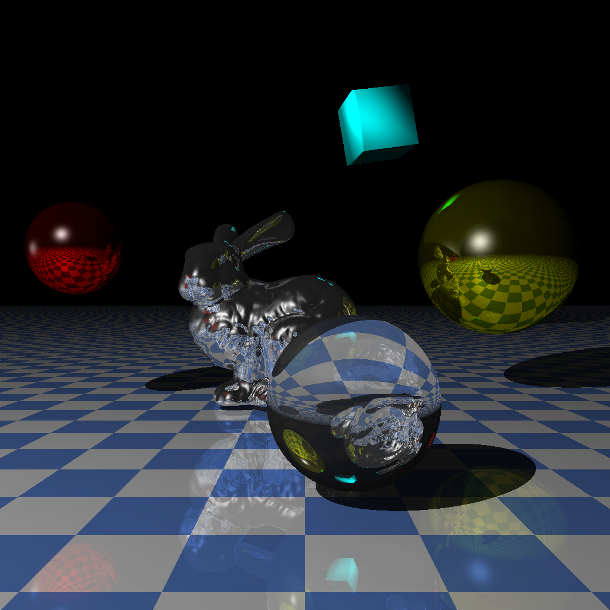

# Ray Tracer

A perspective ray tracer written in C++ that renders scenes with spheres, triangle meshes, reflections, refractions, and procedural textures. Outputs to TIFF.

Originally developed as a course project for **CS-636: Advanced Rendering Techniques** (May 2012).

## Features

- Perspective ray tracing with ray-sphere and ray-triangle mesh intersection
- Diffuse/specular shading (Phong model) with point and directional lights
- Shadows
- Reflective surfaces
- Transparent materials and refractions (Hall shading model)
- 3D rigid transformations (via Instance or at load time)
- Regular grid acceleration structure
- Procedural textures: 3D checker, plane checker, sphere checker
- Anti-aliasing / supersampling: Regular, Jittered, NRooks, MultiJittered, Hammersley, PureRandom, and Adaptive
- Scene definition via text file (`scene.txt`)
- TIFF output (`out.tif`)

## Requirements

- C++11 compiler (g++ recommended)
- libtiff (development headers)
- libjpeg (development headers)

On Debian/Ubuntu:

```sh
sudo apt install g++ libtiff-dev libjpeg-dev
```

## Build and Run

```sh
make            # build (parallel by default with make -j)
make run        # build and run
make clean      # remove build artifacts and executable
make rebuild    # clean + build
```

The executable `myRaytracer` reads `scene.txt` from the current directory and writes `out.tif`.

## Scene Configuration

`scene.txt` defines lights, camera, geometry, and materials. See comments at the top of the file for the format specification. Several `.smf` model files are included in `models/`.

## Example Output

Default scene (1024x1024, adaptive sampling, 69k-triangle bunny, 3 spheres, checker plane):



## Benchmarks

| Date | OS | Compiler | CPU | RAM | Resolution | Render Time |
|---|---|---|---|---|---|---|
| 2026-04-07 | Linux Mint 22.3 (kernel 6.17.0) | g++ 13.3.0 | Intel Core Ultra X7 358H (16 cores) | 64 GB | 1024x1024 | **3.02 s** |
| 2024-09-03 | Ubuntu 22.04 | g++ 11.4.0 | Intel Core i5-4200U | 8 GB | 1024x1024 | -- |
| 2012-05-30 | Windows (ported to Ubuntu 15.04 ~2015) | g++ 4.9.2 | Intel Core i5-4200U | 8 GB | 1024x1024 | -- |

## Project Structure

```
.
├── Makefile              # Build system
├── scene.txt             # Scene definition (input)
├── out.tif / out.png     # Rendered output
├── models/               # 3D models (.smf format)
│   ├── bunny_69k.smf
│   ├── cube.smf
│   └── ...
└── raytracer/            # Source code
    ├── myRaytracer.cpp   # Entry point
    ├── BRDFs/            # Bidirectional reflectance distribution functions
    ├── BTDFs/            # Bidirectional transmittance distribution functions
    ├── Cameras/          # Camera implementations (Pinhole)
    ├── GeometricObjects/ # Primitives, triangles, compound objects
    ├── Lights/           # Ambient, directional, point lights
    ├── Mappings/         # Texture mappings
    ├── Materials/        # Matte, reflective, transparent, spatially-varying
    ├── Samplers/         # Anti-aliasing sample patterns
    ├── Textures/         # Procedural textures (checkers)
    ├── Tracers/          # Ray cast and recursive tracers
    ├── Utilities/        # Math, color, mesh, timer, etc.
    └── World/            # Scene container and view plane
```

## History

- **May 2012** -- Created for CS-636 on Windows
- **~2015** -- Ported to Linux (Ubuntu 15.04, g++ 4.9.2)
- **Sep 2024** -- Updated for Ubuntu 22.04 (g++ 11.4.0)
- **Apr 2026** -- Replaced `run.sh` with Makefile; rebuilt on Linux Mint 22.3 (g++ 13.3.0, kernel 6.17.0)

## Author

Zach Liu

## Additional Models

More `.smf` mesh models: https://www.cs.drexel.edu/~david/Classes/CS586/Models/
